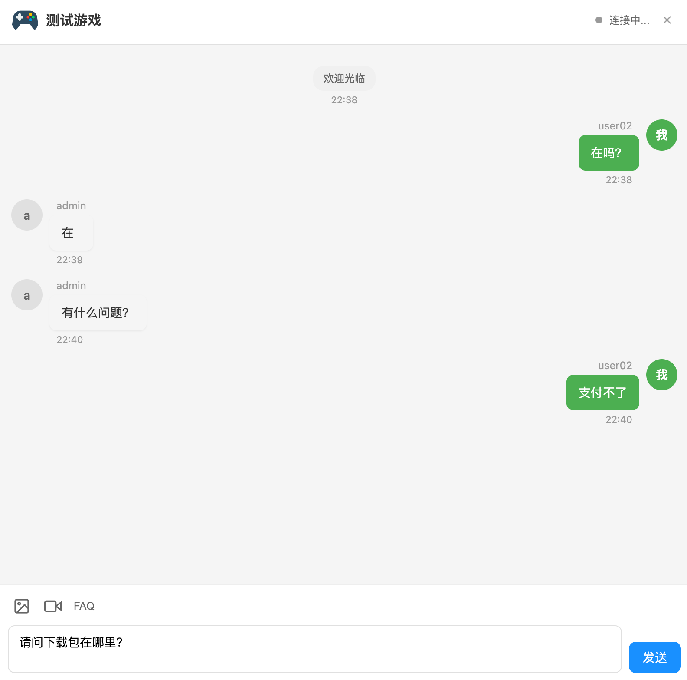

# Live Chat 在线客服系统

一个基于 Go + Vue 3 的实时在线客服系统，支持文本、图片、视频消息，智能FAQ自动回复，以及客服工作台管理。

## 系统架构

```
┌─────────────────┐
│   H5 用户端      │ (Vue 3)
│   WebSocket     │
└────────┬────────┘
         │
┌────────▼────────┐      HTTP      ┌──────────────────┐
│  Live-Chat      │◄────────────────│  管理后台        │
│  服务 (Go)      │                 │  (Gin-Vue-Admin) │
│  - WebSocket    │                 └──────────────────┘
│  - REST API     │
│  - FAQ 匹配     │
└────────┬────────┘
         │
┌────────▼────────┐
│   MySQL 数据库   │
└─────────────────┘
```

## H5界面截图



## 技术栈

### 后端 (Live-Chat Service)
- **语言**: Go 1.24+
- **框架**: Gin 1.11.0
- **数据库**: MySQL 8.0+
- **ORM**: GORM
- **缓存**: Redis 6.0+
- **WebSocket**: Gorilla WebSocket 1.5.3
- **认证**: JWT (golang-jwt 5.2.2)
- **日志**: Uber Zap
- **配置**: Viper (YAML)

### 前端 (H5 Client)
- **框架**: Vue 3.5.13
- **路由**: Vue Router 4.5.0
- **HTTP**: Axios 1.8.4
- **构建工具**: Vite 6.0.0

### 管理后台 (Background Service)
- **后端**: Gin-Vue-Admin
- **前端**: Vue 3 + Element Plus
- **数据库**: 共享 MySQL

## 核心功能

### 用户端功能
- ✅ 实时文本聊天
- ✅ 图片/视频消息发送
- ✅ FAQ 智能搜索
- ✅ 消息已读/未读状态
- ✅ 排队等待提示
- ✅ 会话状态管理
- ✅ 主动关闭会话
- ✅ 历史消息加载

### 客服端功能
- ✅ 多会话管理
- ✅ 实时消息收发
- ✅ 会话分配（手动/自动）
- ✅ 会话状态跟踪
- ✅ 消息搜索过滤
- ✅ 在线状态管理
- ✅ 工作负载均衡

### 系统功能
- ✅ FAQ 智能匹配（相似度算法）
- ✅ 多产品支持
- ✅ 客服工作量统计
- ✅ 会话数据报表
- ✅ 文件上传管理

## 快速开始

### 前置要求

- Go 1.24+
- Node.js 18+
- MySQL 8.0+
- Redis 6.0+

### 1. 数据库初始化

创建数据库：

```sql
CREATE DATABASE live_chat CHARACTER SET utf8mb4 COLLATE utf8mb4_unicode_ci;
```

执行数据库迁移脚本（执行后会自动创建表结构）：

```bash
cd api
go run main.go
```

或手动执行迁移脚本：

```sql
-- 添加已读/未读字段（如果需要）
ALTER TABLE `lc_chat_message`
ADD COLUMN `is_read` TINYINT(1) DEFAULT 0 COMMENT '是否已读' AFTER `faq_id`,
ADD COLUMN `read_at` DATETIME(0) NULL COMMENT '阅读时间' AFTER `is_read`,
ADD INDEX `idx_is_read` (`is_read`);
```

### 2. Live-Chat 服务配置

编辑 `api/config.yaml`：

```yaml
server:
  port: 8890
  mode: debug  # 生产环境改为 release

mysql:
  path: 127.0.0.1
  port: 3306
  db-name: live_chat
  username: your_username
  password: your_password
  max-idle-conns: 10
  max-open-conns: 100

redis:
  db: 0
  addr: 127.0.0.1:6379
  password: your_redis_password
  prefix: "live_chat:"

chat:
  faq_match_threshold: 0.6  # FAQ 匹配阈值
  max_upload_size: 10485760  # 10MB
  allowed_upload_types:
    - image/jpeg
    - image/png
    - image/gif
    - image/webp
    - video/mp4
  session_timeout: 1800  # 30分钟
  agent_assignment: round_robin  # 客服分配策略: round_robin | least_loaded

upload:
  path: ./uploads
  max_size: 10485760  # 10MB

log:
  level: info
  file_path: logs/app.log
  max_size: 100
  max_backups: 7
  max_age: 7
  compress: true
  console: true
```

### 3. 启动 Live-Chat 服务

```bash
cd api
go mod download
go run main.go
```

服务将在 `http://localhost:8890` 启动。

### 4. H5 前端配置

编辑 `h5/.env.development`：

```env
VITE_API_BASE_URL=http://localhost:8890/api/v1
VITE_WS_URL=ws://localhost:8890/ws/chat
```

编辑 `h5/.env.production`：

```env
VITE_API_BASE_URL=https://your-domain.com/api/v1
VITE_WS_URL=wss://your-domain.com/ws/chat
```

### 5. 启动 H5 前端

```bash
cd h5
npm install
npm run dev
```

开发服务器将在 `http://localhost:5173` 启动。

访问示例：
```
http://localhost:5173/?product_code=DEMO&user_id=user001&user_name=测试用户
```

### 6. 管理后台配置

编辑 `background/server/config.yaml`，添加：

```yaml
system:
  live-chat-url: "http://localhost:8890"  # Live-Chat 服务地址
```

启动管理后台服务（参考 background 项目的 README）。

## API 文档

### 用户端 API

#### 初始化会话
```http
POST /api/v1/chat/init
Content-Type: application/json

{
  "product_code": "DEMO",
  "user_id": "user001",
  "user_name": "测试用户",
  "user_token": "",
  "source": "h5"
}
```

#### 获取历史消息
```http
GET /api/v1/chat/history?page=1&pageSize=50
X-Session-Token: <session_token>
```

#### 标记消息已读
```http
POST /api/v1/chat/mark-read
X-Session-Token: <session_token>
Content-Type: application/json

{
  "message_ids": [1, 2, 3]
}
```

#### 获取未读数量
```http
GET /api/v1/chat/unread-count?sender_type=agent
X-Session-Token: <session_token>
```

#### 关闭会话
```http
POST /api/v1/chat/close
X-Session-Token: <session_token>
```

### 管理后台 API

#### 客服回复消息（自动广播）
```http
POST /api/v1/admin/agent-reply
Content-Type: application/json

{
  "session_id": 123,
  "agent_id": 1,
  "agent_name": "客服小王",
  "content": "您好，有什么可以帮您？",
  "msg_type": "text"
}
```

#### 关闭会话（自动通知用户）
```http
POST /api/v1/admin/close-session
Content-Type: application/json

{
  "session_id": 123,
  "reason": "客服已关闭会话"
}
```

### WebSocket 协议

#### 连接
```
ws://localhost:8890/ws/chat?token=<session_token>
```

#### 发送消息
```json
{
  "type": "message",
  "content": "您好",
  "msg_type": "text"
}
```

#### 接收消息
```json
{
  "type": "message",
  "content": "您好，有什么可以帮您？",
  "msg_type": "text",
  "sender_type": "agent",
  "sender_id": "1",
  "sender_name": "客服小王",
  "message_id": 456,
  "is_read": false,
  "timestamp": 1717315200000
}
```

#### 会话关闭通知
```json
{
  "type": "closed",
  "timestamp": 1717315200000
}
```

#### 心跳
```json
// 客户端发送
{"type": "ping"}

// 服务端响应
{"type": "pong", "timestamp": 1717315200000}
```

## 数据库设计

### 核心表

#### lc_chat_session - 会话表
| 字段 | 类型 | 说明 |
|------|------|------|
| id | BIGINT | 主键 |
| product_id | BIGINT | 产品ID |
| user_id | VARCHAR(128) | 用户ID |
| user_name | VARCHAR(128) | 用户名称 |
| agent_id | BIGINT | 客服ID |
| status | VARCHAR(16) | 状态: waiting/active/closed |
| source | VARCHAR(16) | 来源: h5/app/pc |
| user_ip | VARCHAR(64) | 用户IP |
| user_agent | VARCHAR(512) | User Agent |
| closed_at | DATETIME | 关闭时间 |
| created_at | DATETIME | 创建时间 |

#### lc_chat_message - 消息表
| 字段 | 类型 | 说明 |
|------|------|------|
| id | BIGINT | 主键 |
| session_id | BIGINT | 会话ID |
| sender_type | VARCHAR(16) | 发送者类型: user/agent/system |
| sender_id | VARCHAR(128) | 发送者ID |
| sender_name | VARCHAR(128) | 发送者名称 |
| content | TEXT | 消息内容 |
| msg_type | VARCHAR(16) | 消息类型: text/image/video/system |
| attachment_url | VARCHAR(512) | 附件URL |
| is_faq_reply | TINYINT | 是否FAQ自动回复 |
| faq_id | BIGINT | FAQ ID |
| is_read | TINYINT | 是否已读 |
| read_at | DATETIME | 阅读时间 |
| created_at | DATETIME | 创建时间 |

#### lc_agent - 客服表
| 字段 | 类型 | 说明 |
|------|------|------|
| id | BIGINT | 主键 |
| user_id | BIGINT | 用户ID |
| product_id | BIGINT | 产品ID |
| status | VARCHAR(16) | 状态: online/offline/busy |
| max_concurrent | INT | 最大并发数 |
| current_sessions | INT | 当前会话数 |
| total_served | INT | 总服务数 |
| last_online_at | DATETIME | 最后在线时间 |

#### lc_product - 产品表
| 字段 | 类型 | 说明 |
|------|------|------|
| id | BIGINT | 主键 |
| product_code | VARCHAR(64) | 产品代码 |
| name | VARCHAR(128) | 产品名称 |
| logo | VARCHAR(512) | Logo URL |
| welcome_title | VARCHAR(128) | 欢迎标题 |
| welcome_message | TEXT | 欢迎消息 |
| status | VARCHAR(16) | 状态: active/inactive |

#### lc_faq - FAQ表
| 字段 | 类型 | 说明 |
|------|------|------|
| id | BIGINT | 主键 |
| product_id | BIGINT | 产品ID |
| category | VARCHAR(64) | 分类 |
| question | VARCHAR(512) | 问题 |
| answer | TEXT | 答案 |
| keywords | VARCHAR(512) | 关键词 |
| priority | INT | 优先级 |
| match_count | INT | 匹配次数 |
| status | VARCHAR(16) | 状态 |

## 部署指南

### 生产环境部署

#### 1. 编译后端
```bash
cd api
CGO_ENABLED=0 GOOS=linux GOARCH=amd64 go build -o live-chat main.go
```

#### 2. 构建前端
```bash
cd h5
npm run build
```

生成的文件在 `h5/dist` 目录。

#### 3. Nginx 配置示例

```nginx
# WebSocket 升级配置
map $http_upgrade $connection_upgrade {
    default upgrade;
    '' close;
}

server {
    listen 80;
    server_name your-domain.com;

    # H5 前端
    location / {
        root /path/to/h5/dist;
        try_files $uri $uri/ /index.html;
    }

    # API 代理
    location /api/ {
        proxy_pass http://localhost:8890;
        proxy_set_header Host $host;
        proxy_set_header X-Real-IP $remote_addr;
        proxy_set_header X-Forwarded-For $proxy_add_x_forwarded_for;
    }

    # WebSocket 代理
    location /ws/ {
        proxy_pass http://localhost:8890;
        proxy_http_version 1.1;
        proxy_set_header Upgrade $http_upgrade;
        proxy_set_header Connection $connection_upgrade;
        proxy_set_header Host $host;
        proxy_set_header X-Real-IP $remote_addr;
        proxy_read_timeout 3600s;
        proxy_send_timeout 3600s;
    }

    # 文件上传大小限制
    client_max_body_size 10M;
}
```

#### 4. Systemd 服务配置

创建 `/etc/systemd/system/live-chat.service`：

```ini
[Unit]
Description=Live Chat Service
After=network.target mysql.service redis.service

[Service]
Type=simple
User=www-data
WorkingDirectory=/path/to/live-chat/api
ExecStart=/path/to/live-chat/api/live-chat
Restart=always
RestartSec=5
StandardOutput=journal
StandardError=journal

[Install]
WantedBy=multi-user.target
```

启动服务：
```bash
sudo systemctl daemon-reload
sudo systemctl enable live-chat
sudo systemctl start live-chat
```

## 性能优化

### 数据库优化
```sql
-- 为常用查询字段添加索引
CREATE INDEX idx_session_status ON lc_chat_session(status);
CREATE INDEX idx_session_agent ON lc_chat_session(agent_id);
CREATE INDEX idx_message_session ON lc_chat_message(session_id, created_at);
CREATE INDEX idx_message_read ON lc_chat_message(is_read, sender_type);
```

### Redis 缓存
- 会话信息缓存（TTL: 30分钟）
- 在线客服列表缓存（TTL: 1分钟）
- FAQ 热门问题缓存（TTL: 1小时）

### WebSocket 连接池
- 默认最大连接数: 10000
- 心跳间隔: 30秒
- 读取超时: 60秒
- 写入超时: 10秒

## 监控和日志

### 日志级别
- **debug**: 开发环境
- **info**: 生产环境（默认）
- **warn**: 警告信息
- **error**: 错误信息

### 关键监控指标
- WebSocket 连接数
- 活跃会话数
- 消息处理延迟
- FAQ 匹配率
- 客服平均响应时间
- 数据库连接池状态

## 故障排查

### 常见问题

#### 1. WebSocket 连接失败
- 检查 token 是否有效
- 检查防火墙和 Nginx 配置
- 查看 WebSocket 升级协议是否正确

#### 2. 消息发送失败
- 检查会话状态是否为 active
- 检查数据库连接
- 查看后端日志

#### 3. FAQ 不匹配
- 调整 `faq_match_threshold` 阈值
- 优化 FAQ 关键词配置
- 检查 FAQ 状态是否为 active

#### 4. 管理后台消息显示两条
- 确保 background 服务配置了正确的 `live-chat-url`
- 检查是否同时保存了消息到数据库
- 查看网络请求是否重复

## 安全建议

- ✅ 使用 HTTPS/WSS 加密传输
- ✅ JWT Token 定期过期和刷新
- ✅ 文件上传类型和大小限制
- ✅ SQL 注入防护（GORM 参数化查询）
- ✅ XSS 防护（前端输出转义）
- ✅ CORS 配置限制
- ✅ 速率限制（防止恶意请求）
- ✅ 敏感信息脱敏（日志中）

## 开发规范

### Git 提交规范
```
feat: 新功能
fix: 修复bug
docs: 文档更新
style: 代码格式调整
refactor: 重构
test: 测试
chore: 构建/工具链
```

### 代码风格
- Go: 遵循 `gofmt` 和 `golint`
- Vue: 遵循 Vue 3 风格指南
- 使用 ESLint 和 Prettier

## 许可证

本项目仅供学习和参考使用。

## 联系方式

如有问题或建议，请提交 Issue。

---

最后更新: 2026-06-02
